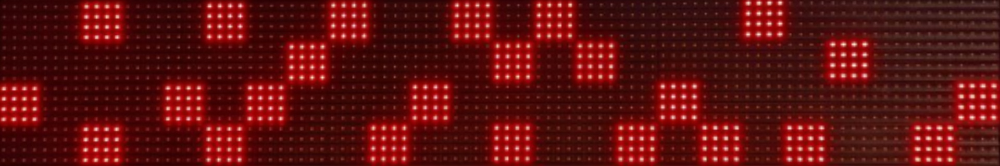
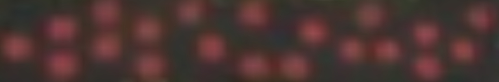
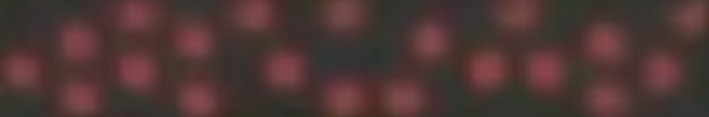
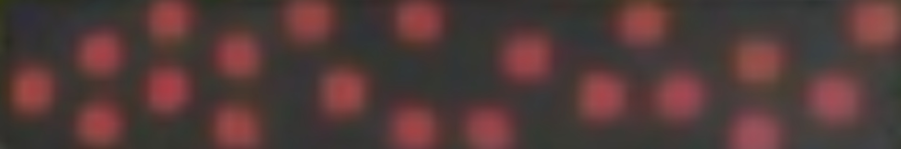
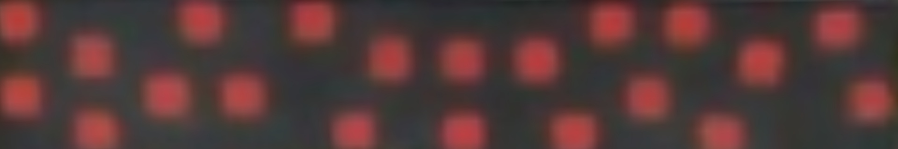
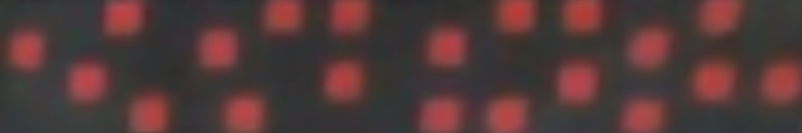
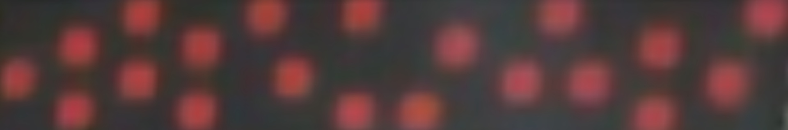

****** IMPORTANT *******

This example will run on Python3.8 and OpenCV4.

There are some assumptions:
  1. The input is the result of yolo sign detection (ex. data/images/panel.jpg)
  2. It only detect single square
  3. The resolution is high enough
  4. All panels are the same size
  5. There is no rotation in image
  6. There is no prespective in image

Usage:
    
        python3 main.py --source path/to/image
    
Example:
        
        python3 main.py --source data/images/panel.jpg

or use default path:
        
        python3 main.py

Input Image:

Output:

        1 0 1 0 1 0 1 0 1 0 1 0 1 0 1 0 1 0 1 0 1 0 1 0 1 0 1 0 1 0 1 0
        0 1 0 1 0 1 0 1 0 1 0 1 0 1 0 1 0 1 0 1 0 1 0 1 0 1 0 1 0 1 0 1
        1 0 1 0 1 0 1 0 0 0 0 0 1 0 0 0 1 0 1 0 0 0 1 0 1 0 1 0 0 0 0 0
        0 0 0 0 1 0 1 0 1 0 1 0 0 0 0 0 1 0 0 0 1 0 1 0 0 0 1 0 1 0 1 0
        1 0 0 0 0 0 0 0 0 0 0 0 1 0 0 0 1 0 1 0 0 0 1 0 1 0 1 0 0 0 0 0
        0 0 0 0 1 0 0 0 0 0 0 0 0 0 0 0 1 0 0 0 1 0 1 0 0 0 1 0 1 0 1 0
        1 0 0 0 0 0 0 0 0 0 0 0 0 0 0 0 0 0 0 0 0 0 1 0 1 0 1 0 0 0 0 0
        0 0 0 0 1 0 0 0 0 0 0 0 0 0 0 0 0 0 0 0 0 0 0 0 0 0 1 0 1 0 1 0

Input Image:

Output:

        0 0 1 0 0 1 0 0 1 0 0 1 0 1 0 0 0 0 1 0 0 0 0 0
        0 0 0 0 0 0 0 1 0 0 0 0 1 0 1 0 0 0 0 0 1 0 0 0
        1 0 0 0 1 0 1 0 0 0 1 0 0 0 0 0 1 0 0 0 0 0 0 1
        0 0 1 0 0 1 0 0 0 1 0 0 1 0 0 1 0 1 0 1 0 0 1 0  

Hard Cases Inputs:

Input 1:

Output:

        0 0 0 0 0 1 0 0 0 1 0 0 1 0 0 0 0 1 0 0 0 0 0 1
        0 0 0 1 0 0 0 1 0 0 0 0 0 0 0 1 0 0 0 0 1 0 0 0
        1 0 0 0 0 1 0 0 0 0 1 0 0 0 0 0 1 0 1 0 0 0 1 0
        0 0 0 1 0 0 0 1 0 0 0 0 1 0 1 0 0 0 0 0 1 0 0 0 

Input 4:

Output:

        0 0 0 0 1 0 0 0 1 0 0 0 0 0 0 0 0 1 0 0 0 0 0 0
        0 0 1 0 0 0 1 0 0 0 0 0 0 0 1 0 0 0 0 0 1 0 0 0
        1 0 0 0 1 0 0 0 0 1 0 0 0 0 0 0 1 0 1 0 0 0 1 0
        0 0 1 0 0 0 1 0 0 0 0 1 0 1 0 0 0 0 0 0 1 0 0 0

Input 5:

Output:

        0 0 0 0 1 0 0 0 1 0 0 1 0 0 0 0 0 1 0 0 0 0 0 1
        0 0 1 0 0 0 1 0 0 0 0 0 0 0 1 0 0 0 0 0 1 0 0 0
        1 0 0 0 1 0 0 0 0 1 0 0 0 0 0 0 1 0 1 0 0 0 1 0
        0 0 1 0 0 0 1 0 0 0 0 1 0 1 0 0 0 0 0 0 1 0 0 0

Input 6:

Output:

        1 0 0 0 0 1 0 0 1 0 0 0 0 0 0 0 1 0 1 0 0 0 1 0
        0 0 1 0 0 0 0 0 0 0 1 0 1 0 1 0 0 0 0 0 1 0 0 0
        1 0 0 0 1 0 1 0 0 0 0 0 0 0 0 0 0 1 0 0 0 0 0 1
        0 0 1 0 0 0 0 0 0 1 0 0 1 0 0 1 0 0 0 1 0 0 0 0

Input 7:

Output:

        0 0 0 1 0 0 0 0 1 0 1 0 0 0 0 1 0 1 0 0 0 1 0 0
        1 0 0 0 0 0 1 0 0 0 0 0 0 1 0 0 0 0 0 1 0 0 0 0
        0 0 1 0 0 0 0 0 0 0 1 0 0 0 0 0 0 1 0 0 0 1 0 1
        0 0 0 0 1 0 0 1 0 0 0 0 0 1 0 1 0 0 0 1 0 0 0 0

Input 8:

Output:

        0 0 0 0 1 0 0 0 1 0 0 1 0 0 0 0 0 1 0 0 0 0 0 1
        0 0 1 0 0 0 1 0 0 0 0 0 0 1 0 0 0 0 0 0 1 0 0 0
        1 0 0 0 1 0 0 0 1 0 0 0 0 0 0 1 0 0 1 0 0 0 1 0
        0 0 1 0 0 0 1 0 0 0 1 0 1 0 0 0 0 0 0 1 0 0 0 0